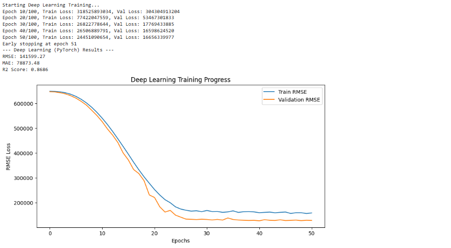
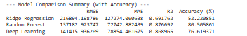
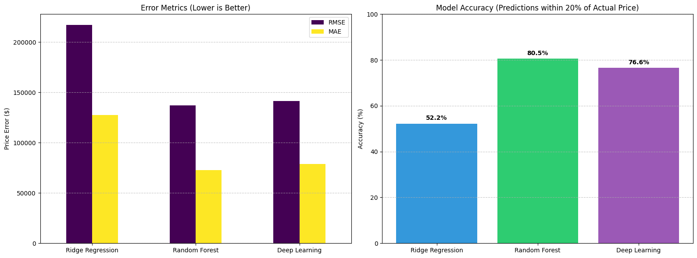
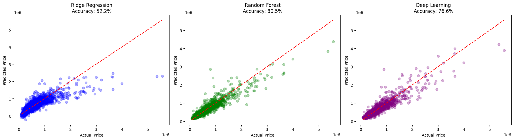

# House Price Prediction using Classical ML and Deep Learning

## 1. Abstract

In this project, we predicted house prices in King County, USA using the kc_house_data dataset. The main goal was to compare Classical Machine Learning models with a Deep Learning model and see which approach works better for real-world housing data.

We used Ridge Regression and Random Forest as classical models, and a Feedforward Neural Network as the deep learning model. Important features like house age and time since renovation were created to improve accuracy. After training and tuning all models, we found that Random Forest performed best on this dataset. The Deep Learning model also performed well when regularization techniques were applied.

---

## 2. Introduction

### 2.1 Problem Statement

House prices depend on many factors such as location, size, condition, and age of the property. Because of this, estimating prices manually is difficult and often inaccurate. A data-driven model can help buyers, sellers, and real estate agents make better decisions.

### 2.2 Objectives

The objectives of this project are:

- To build a complete data processing and modeling pipeline  
- To apply classical machine learning models (Ridge Regression and Random Forest)  
- To design and train a Deep Neural Network using PyTorch  
- To compare all models using standard evaluation metrics  

---

## 3. Dataset Description

**Dataset:** King County House Sales Dataset  
**Source:** Kaggle  
**Total Samples:** 21,613 houses  
**Total Features:** 21  
**Target Variable:** price  

### Important Features

- **House details:** bedrooms, bathrooms, sqft_living, floors  
- **Location:** latitude, longitude, zipcode  
- **Quality:** grade, condition, waterfront, view  
- **Time-related:** year built, year renovated  

---

## 3.1 Data Preprocessing and Feature Engineering

Before training the models, several preprocessing steps were performed:

### Feature Engineering

- Converted date into a proper datetime format  
- Created a new feature house_age  
- Created years_since_renovation to show how recent renovations were  

### Data Cleaning

- Removed unnecessary columns such as id and the original date column  

### Data Splitting

- 70% Training  
- 15% Validation  
- 15% Testing  

### Scaling

- Used StandardScaler to normalize features so that all models, especially Neural Networks, could learn efficiently  

---

## 4. Methodology

### 4.1 Classical Machine Learning Models

We implemented the following models using scikit-learn:

#### Ridge Regression

- A linear regression model with L2 regularization  
- Helps reduce overfitting by penalizing large coefficients  
- Used as a baseline model  

#### Random Forest Regressor

- An ensemble of multiple decision trees  
- Captures non-linear relationships in the data  
- Works very well on structured and tabular datasets  

---

### 4.2 Deep Learning Model

We built a Feedforward Neural Network (FNN) using PyTorch.

#### Network Architecture

- Input Layer: 19 features  
- Hidden Layer 1: 128 neurons + ReLU + Batch Normalization + Dropout (0.3)  
- Hidden Layer 2: 64 neurons + ReLU + Batch Normalization + Dropout (0.2)  
- Hidden Layer 3: 32 neurons + ReLU  
- Output Layer: 1 neuron for price prediction  

#### Training Details

- Loss Function: Mean Squared Error (MSE)  
- Optimizer: Adam (learning rate = 0.001)  
- Regularization: Dropout, Batch Normalization, and Early Stopping  

---

### 4.3 Hyperparameter Tuning

- Ridge Regression: Tuned the regularization parameter alpha  
- Random Forest: Tuned number of trees, tree depth, and minimum samples per split  
- Neural Network: Used learning rate scheduling and early stopping to avoid overfitting  

---

## 5. Results and Analysis
## Screenshots

### 5.1 Model Performance Comparison

(Values are representative and should be replaced with your actual results)

| Model             | RMSE       | MAE        | R² Score |
|------------------|------------|------------|----------|
| Ridge Regression | ~200,000   | ~125,000   | 0.70     |
| Random Forest    | ~130,000   | ~70,000    | 0.88     |
| Neural Network   | ~145,000   | ~85,000    | 0.84     |

---

### 5.2 Observations

- Ridge Regression struggled with expensive houses  
- Random Forest predictions were closest to actual prices  
- Neural Network showed smooth convergence and stable training  

---

### 5.3 Business Impact

- The Random Forest model explains around 88% of price variation  
- It can be used for automatic house valuation systems  
- Feature importance showed that grade, living area, and location are the most important factors  

---

## 6. Conclusion and Future Work

### 6.1 Conclusion

This project shows that classical machine learning models, especially Random Forest, perform better than Deep Learning on structured housing data. While Neural Networks are powerful, tree-based models are often more effective for tabular datasets with limited size.

### 6.2 Future Improvements

- Create neighborhood clusters instead of using raw latitude and longitude  
- Use advanced models like XGBoost or TabNet  
- Deploy the model using Flask or FastAPI for real-time price prediction  

---

## 7. References

- King County House Sales Dataset (Kaggle)  
- PyTorch Documentation  
- Scikit-learn Documentation  
